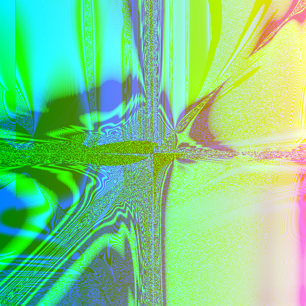
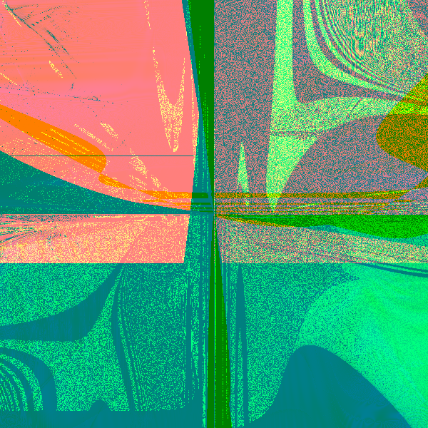

# RandomArt


## Usage

To generate an image, use the `generate_image` function. It requires a seed, width, height, and depth as parameters.

```rust
use image_generator::generate_image;

let (img, expr) = generate_image("example seed", 800, 600, 5);
img.save("output.png").unwrap();
println!("{}", expr);
```

## Examples
</img>
</img>
</img>
</img>